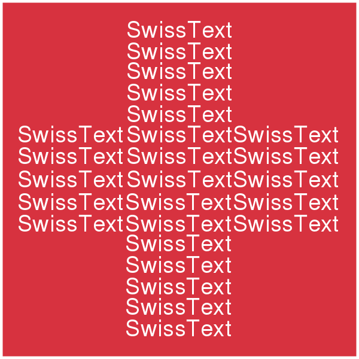

<!-- # **Simply The Text! NLP Solutions for Accessibility Challenges**  -->
<!-- ### *A SwissText Workshop, Chur, 10th June 2024* -->

<h1 align="center"><b>Simply The Text! NLP Solutions for Accessibility Challenges</b></h1>
<h3 align="center"><i>A <a href="https://www.swisstext.org/" target="_blank">SwissText</a> Workshop</i> – <a href="https://maps.app.goo.gl/KQYanMg396GuQ5cw8" target="_blank">📍</a> <i>Chur (Switzerland), June 2024</i></h3>

---

## __Workshop theme__

In recent years, Natural Language Processing (NLP) has emerged as a powerful tool in enhancing accessibility across various domains, including administration, healthcare, education, transport, and the media, to name but a few. Various NLP-driven solutions, like augmentative and alternative communication technologies, interactive conversational agents, or real-time captioning and subtitling have substantially improved information access for all. Indeed, a wide range of users, such as children, second language learners, individuals with learning or reading disorders, older adults, and people with disabilities, have already benefited from smoother communication interactions in all spheres of life thanks to NLP-based technology. 

The advancement from the synergy between NLP and accessibility in various sectors is evident, yet it faces significant challenges. Key among these is the need for adaptable models that can understand and interpret the full spectrum of human communication. Moreover, NLP technologies should be accessible to all, irrespective of geographical location, language, or technological expertise. The scarcity of comprehensive and multimodal datasets represents another significant barrier as many current datasets are limited in scope, focusing on specific languages or types of communication.

This workshop aims to bring together researchers and practitioners from both academia and industry to explore not only the latest advancements in NLP solutions and their application for promoting accessibility, but also to discuss existing obstacles and how these can be addressed. In this sense, we welcome position papers and contributions either presenting novel ideas (even if they are still work-in-progress) or describing finalized solutions.

We invite proposals on, but not limited to, the following topics:

* Interactive conversational agents for healthcare accessibility.
* NLP for educational accessibility.
* Real-time captioning and subtitling through NLP.
* NLP for sign language recognition and translation.
* Accessible content creation and information retrieval.
* NLP in humanitarian aid and crisis management.
* Bias mitigation in NLP.
* Speech technologies for assistive devices.
* NLP for enhanced web accessibility.
* NLP-driven mental health support platforms.
* Machine translation for low-resource languages.
* NLP for enhancing public service accessibility.
* Cross-cultural communication and NLP.
* Multilingual and dialect-sensitive NLP systems.
* Ethical AI and human-centered NLP design.
* NLP applications tailored for the multilingual Swiss environment.

## __Submissions__

Authors should submit __an extended abstract (1-2 pages)__ including relevant information on these four aspects: 

1. Description of the problem to be solved.
2. Proposed or envisioned solution (if the problem has not been solved yet).
3. Current development stage: early work (goal identification, tasks to be performed), work-in-progress (design, implementation, testing), prototyping, etc.
4. Next steps to be taken.

Submission format for extended abstracts:

* Please use the <a href="https://2023.aclweb.org/calls/style_and_formatting/" target="_blank">ACL style</a>.
* Language: English.

Selected contributions will be presented during the workshop in the form of __pitches__. Following each presentation, authors will engage the audience by posing one question to initiate further discussion. This will allow discussing ideas on how to address the challenges identified during the pitch. Authors will have the possibility to showcase their solutions in the form of short demos, regardless of their current development stage, but it is not a requirement for the submission to be accepted.

Accepted abstracts will be part of the SwissText conference proceedings.

__Abstracts should be sent to:__ [simplythetext@unige.ch](mailto:simplythetext@unige.ch)

## __Tentative structure__

With *Simply The Text!* our main goal is to provide an interactive forum for discussion where information and communication access advocates from different fields seek solutions to current challenges through NLP-based ideas. We envision a 2-hour workshop, with the following tentative structure:

| Title | Notes |
| ----------- | ----------- |
| __Introduction__ | Brief presentation by the organizing committee, describing the workshop dynamics |
| __Invited speaker__ | Sarah Ebling - Full Professor of Language‚ Technology and Accessibility, University of Zurich |
| __Pitch session__ | Presentation of the accepted abstracts |
| __Discussion__ | Interactive demos, active discussion with ideas on how to address challenges identified during the workshop |

## __Important dates__

All deadlines are 11:59PM UTC-12:00 (<a href="https://time.is/Anywhere_on_Earth" target="_blank">Anywhere on Earth</a>)

* Abstract submissions: __April 15th__.
* Acceptance notification: __April 30th__.
* Camera-ready version: __May 15th__.

## __Organizing committee__
* <a href="https://www.unige.ch/fti/en/faculte/departements/dtim/membrestim/ormaechea-grijalba/" target="_blank">Lucía Ormaechea</a>, TIM/FTI, University of Geneva, [Lucia.OrmaecheaGrijalba@unige.ch](mailto:Lucia.OrmaecheaGrijalba@unige.ch)
* <a href="https://www.unige.ch/fti/en/faculte/departements/dtim/membrestim/tsourakis/" target="_blank">Nikolaos Tsourakis</a>, TIM/FTI, University of Geneva, [Nikolaos.Tsourakis@unige.ch](mailto:Nikolaos.Tsourakis@unige.ch)
* <a href="https://www.unige.ch/fti/en/faculte/departements/dtim/membrestim/rodriguez/" target="_blank">Silvia Rodríguez Vázquez</a>, TIM/FTI, University of Geneva, [Irene.Strasly@unige.ch](mailto:Irene.Strasly@unige.ch)
* <a href="https://www.unige.ch/fti/en/faculte/departements/dtim/membrestim/strasly/" target="_blank">Irene Strasly</a>, TIM/FTI, University of Geneva, [Irene.Strasly@unige.ch](mailto:Irene.Strasly@unige.ch)

  

This workshop is organized by members and collaborators of the ‘<a href="https://sans-barriere.unige.ch/projets-de-recherche/uni-access/membres" target="_blank">Centre de recherche sur la communication sans barrière en Suisse Romande</a>’, founded by the Department of Translation Technology (TIM) at the Faculty of Translation and Interpreting (FTI) of the University of Geneva. The center is devoted to advancing <a href="https://sans-barriere.unige.ch/projets-de-recherche/uni-access" target="_blank">research projects in NLP and accessibility</a>, with the ultimate goal of fostering a society that is both inclusive and multilingual.

  
